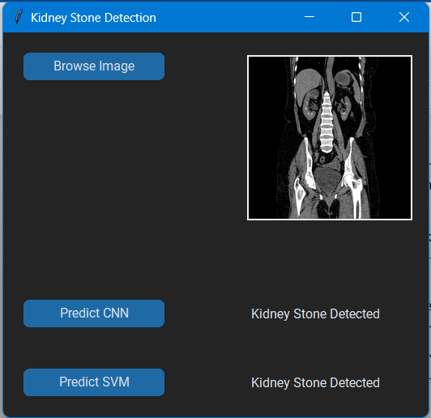

# Kidney Stone Detection

## Introduction:
  This project aims to classify kidney stones in CT images using a combination of Convolutional Neural Network (CNN) and Support Vector Machine (SVM) models. The process involves data preparation, model building, training, testing, and the creation of graphical user interfaces (GUIs) for user-friendly interactions.

## Background: 
  The early diagnosis of diseases is crucial for effective treatment and management. Medical images such as X-rays, MRIs, and CT scans play a vital role in the diagnosis of diseases. However, the analysis of medical images is a complex and time-consuming task that requires the expertise of a trained medical professional. This project aims to develop a disease diagnosis system that can analyze medical images and assist medical professionals in the diagnosis of diseases.

## Methodology: 
  The system will utilize image processing and computer vision techniques, such as feature extraction and object detection, to analyze the images and detect abnormalities. The extracted features will be used to train machine learning algorithms, such as convolutional neural networks (CNNs) & SVmM, to classify the images into different categories based on the detected abnormalities. Tk inter Graphical User Interface(GUI) is used.

## Project Structure

1. **Data Preparation:**
    - Utilize Python libraries such as NumPy, Pandas, and OpenCV to organize and structure training data from the `./CT_Images/Train` directory.
    - Visualize the distribution of categories within the training dataset.

2. **Visualization:**
    - Randomly select and display a sample CT image for visual inspection.

3. **CNN Model Building:**
    - Define a CNN model using the Keras library, including convolutional layers, pooling layers, and dense layers.
    - Implement callbacks, such as early stopping and learning rate reduction, to enhance model training.
    - Compile the CNN model with appropriate loss functions and optimizers.

4. **Data Augmentation:**
    - Apply image data augmentation techniques using the Keras ImageDataGenerator for the training dataset.
    - Generate training and validation data batches for model training.

5. **Training:**
    - Train the CNN model using the prepared data and evaluate its performance.
    - Visualize the training history, including accuracy and loss trends.
    - Save the trained CNN model for future use.

6. **SVM Model Building:**
    - Read and organize training data for the SVM model from the `CT_images/Train` directory.
    - Extract Histogram of Oriented Gradients (HOG) features from images.
    - Train an SVM model using the scikit-learn library.

7. **Testing:**
    - Load and organize test data from the `./CT_Images/Test` directory.
    - Apply the trained CNN and SVM models to make predictions on the test data.
    - Evaluate and visualize the results, including confusion matrices.

8. **Graphical User Interface (GUI) Development:**
    - Implement a GUI using the Tkinter library for image selection and prediction.
    - Include buttons for invoking CNN and SVM predictions based on selected images.
    - 

9. **Gradio App:**
    - Develop a Gradio interface for online prediction using the trained CNN model.
    - Define image preprocessing functions to prepare images for model input.
    - 

10. **Running the GUI and Gradio:**
    - Execute the Tkinter-based GUI for interactive user input and predictions.
    - Launch the Gradio app for online predictions using the CNN model.

## How to Use

1. Ensure all required dependencies are installed by referring to the `requirements.txt` file.
2. Run the provided scripts to train the CNN and SVM models.
3. Execute the Tkinter-based GUI for image selection and predictions.
4. Launch the Gradio app for online predictions using the CNN model.

Feel free to explore and contribute to this project. For more details on specific scripts, model usage, and dependencies, please refer to the respective sections of the documentation.

**Note:** If you prefer pre-trained models, they are available in the repository for direct use.

## Contributors

- Junaid Ali Bhatti

Feel free to contact me.